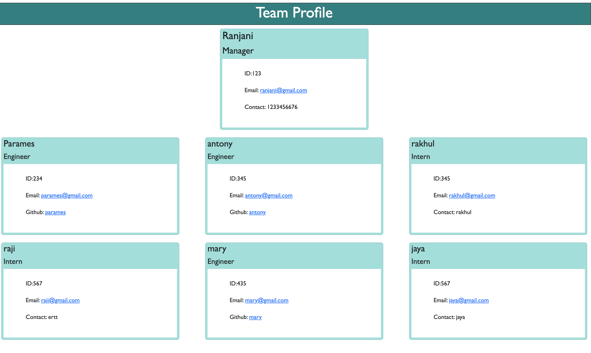

# Team Profile Generator

## Description
* As a Manager, user would be able to generate a webpage that displays team's basic information, which allows quick access to email & GitHub profiles.

## Table of contents

-[Description](#description)

-[Acceptance-Criteria](#acceptance-criteria)

-[How to](#how-to)

-[Mock-up screen](#mock-up-screen)

## Acceptance Criteria 

Givan a command-line application that accpets user input, 
WHEN prompted for my team members and their information, THEN a Webpage is generated that displays a nicely formatted team profile based on user input
WHEN user starts the application, THEN I am prompted to enter the manager's name, employee id, email and contact number
WHEN user enters the team managers information (name, employee ID, email and contact number), THEN I am presented with a menu with option to add an engineer or an intern or to finish building team profile
WHEN user selects engineer option, THEN I am prompted to enter the engineer's name, employee id, email and Github username and taken back to menu prompt
WHEN user selects intern option, THEN I am prompted to enter intern's name, employee id, email and school and taken back to menu prompt
WHEN user decides to finish building team profile, THEN user selects finish option from menu, application is exit and HTML page is generated
WHEN user clicks on email address in the HTML, THEN my default email program opens and populates the TO field of the email with address selected
WHEN user clicks on the GitHUB username, THEN that GitHub profile opens up in a new tab

## How to:

* This applciation uses node.js, Inquirer(to get user input), Jest(unit testing)

* How to Install: 
npm init
npm i inquirer@8.2.4
npm install --save-dev 

* How to Invoke: in command line 'node index.js'

* How to Test: npm test

* Future development: Adding validation to user input

## Mock-up screen:

### Github URL: 
https://github.com/Sivaparam/team-profile-generator

### Sample HTML page generated:
https://github.com/Sivaparam/team-profile-generator/blob/main/dist/index.html

